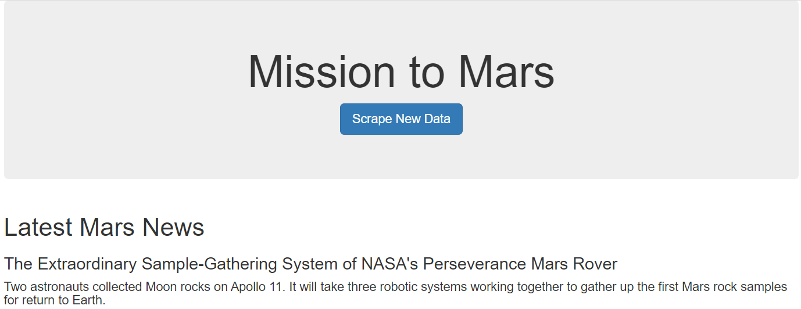
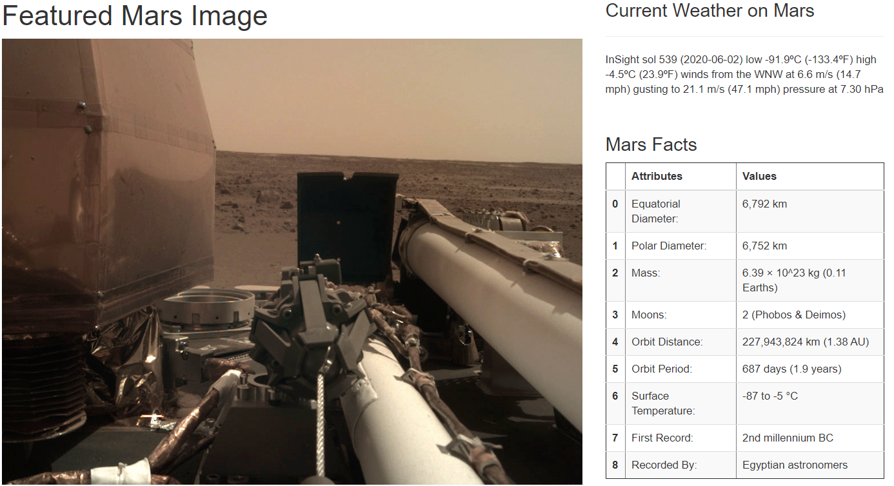
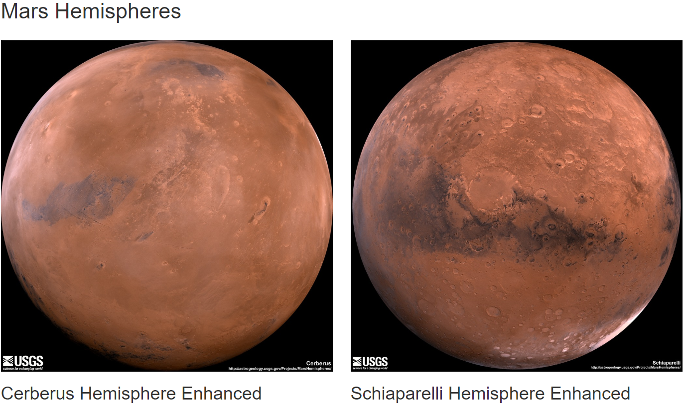
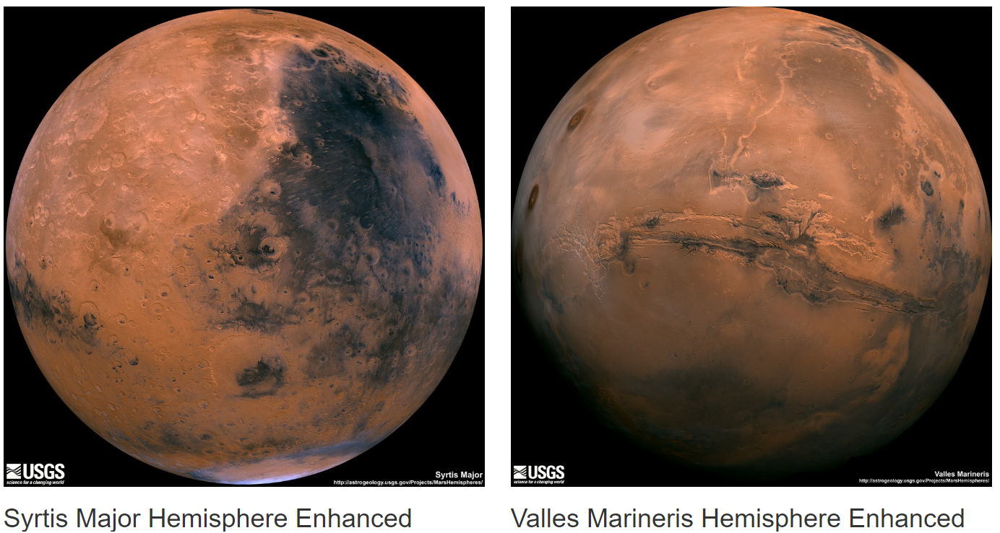

# Web Scraping

## Background

A web application created scraping data from various websites related to the Mission to Mars.  All data later displayed in a single HTML page. Initial scraping completed in a Jupyter Notebook, using BeautifulSoup, Pandas, and Requests/Splinter coding and later converted into a Python Script.

## Scraping

All data scraped and stored into a Python dictionary and sent to a MongoDB database to be used when building the HTML Page. 

#### NASA Mars News
https://mars.nasa.gov/news/

Web elements observed to extract the latest News Title and Paragraph Text. 

#### JPL Mars Space - Featured Image
https://www.jpl.nasa.gov/spaceimages/?search=&category=Mars

JPL website visited to scrape the data of the current feature image, which changes several times throughout the day.  Splinter coding was used to navigate the site and assign the url string to a variable added to the dictionary.

#### Mars Weather
https://twitter.com/marswxreport?lang=en

Mars Weather twitter account visited to scrape the latest Mars weather tweet from the page. 

#### Mars Facts
https://space-facts.com/mars/

Pandas library used to scrape the table containing facts about the planet including Diameter, Mass, etc.  Data was then converted to an HTML table string allowing for visualization on the HTML page.

#### Mars Hemispheres
https://astrogeology.usgs.gov/search/results?q=hemisphere+enhanced&k1=target&v1=Mars

High resolution images obtained for each of Mar's hemispheres.  The image url string for the full resolution hemisphere image, and the Hemisphere title containing the hemisphere name stored into the Python dictionary.

## MongoDB and Flask Application
MongoDB used with Flask templating to create a new HTML page that displays all of the information that was scraped from the URLs above.

Route created to import python script and run the scrape function.

Return data stored in MongoDB as a Python dictionary.

Mongo database queried to pass the mars data into an HTML template to display the data.

HTML file created to display all of the data in the appropriate HTML elements.

HTML button used to renew queries and display the latest changing data.

